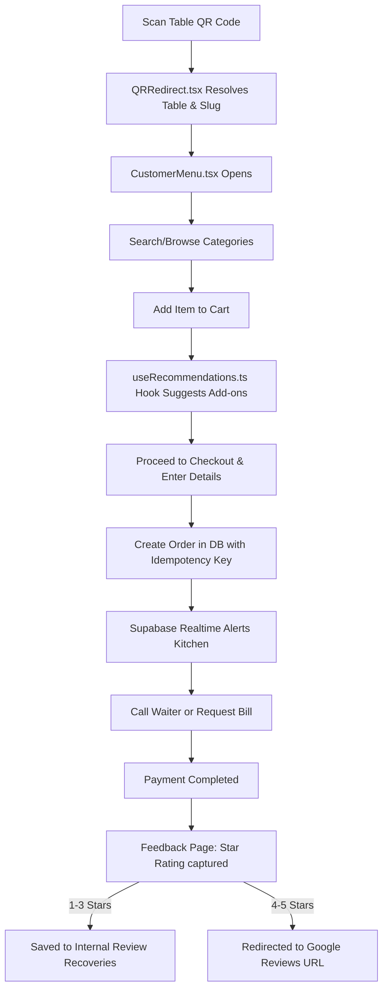
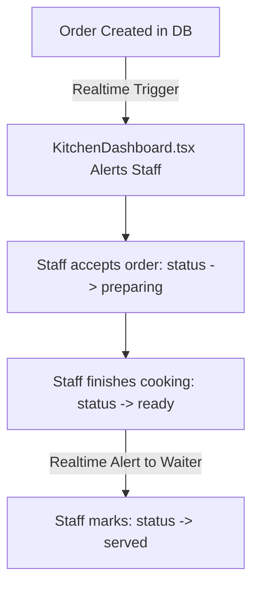
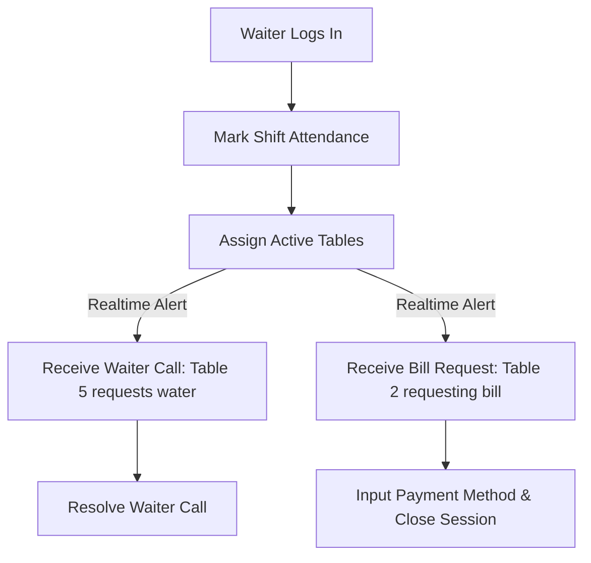
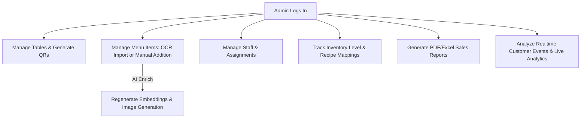
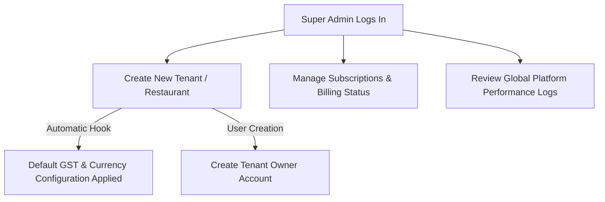
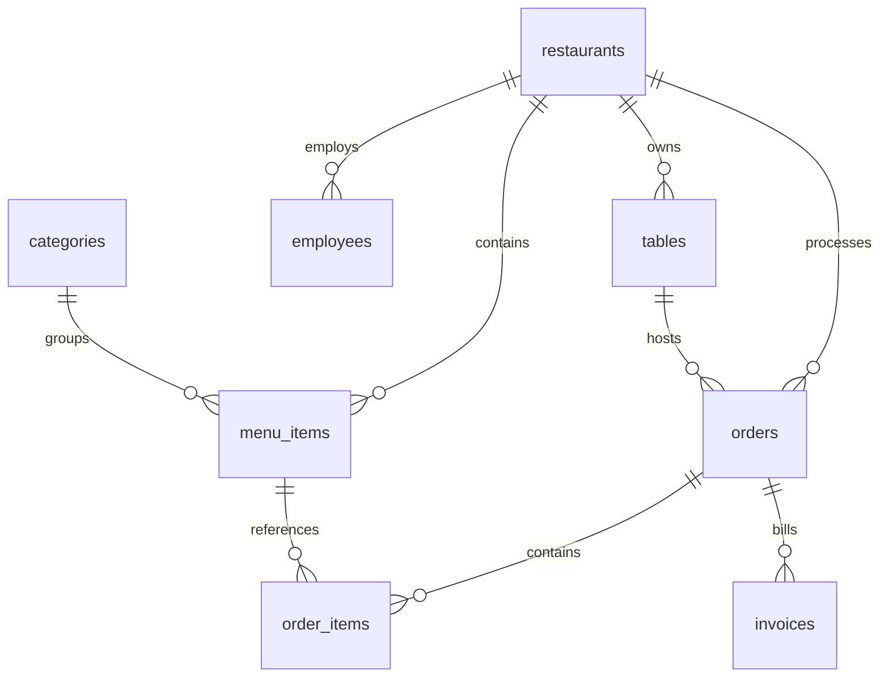

# Zappy Developer Handbook — "The Restaurant Operating System"
*Author: Zappy Core Architecture Team*
*Target Audience: Incoming Engineers, Tech Leads, and Architects*

Welcome to the **Zappy Developer Handbook**. This document provides a complete technical deep-dive into the architecture, codebase, database schema, and operational workflows of Zappy. After reading this handbook, a new engineer should be able to understand the system architecture, run the development environment, and trace customer-to-billing lifecycles in under 30 minutes.

---

## 1. Executive Summary

### What Zappy Is
Zappy is a comprehensive, multi-tenant, cloud-native **Restaurant Operating System (OS)** designed to digitize and automate dine-in operations. It replaces manual processes with a self-service ordering ecosystem, a digitized kitchen display system (KDS), waiter service assistance, automated cashier billing, and AI-driven growth modules.

### Problems Solved
- **High Operational Latency:** Minimizes wait times by enabling customers to order directly from their table via QR codes.
- **Order Placement Friction:** Uses smart recommendations (cross-selling sides, drinks, combos) to increase average order values.
- **Inefficient Staff Coordination:** Real-time waiter dispatching and automated kitchen ticket tracking reduce human errors.
- **Negative Public Reviews:** Standardizes feedback capturing (1-3 stars routed to internal recovery, 4-5 stars directed to Google Reviews).
- **Manual Menu Entry:** Automates onboarding via AI OCR menu imports.

### Target Customers
- Dine-in restaurants, cafes, hotels, food courts, and large restaurant chains looking for multi-outlet management.

### Revenue Model
Zappy operates on a multi-tier SaaS Subscription model (Free, Basic, Pro, Enterprise) billed monthly or annually, with additional transaction-based or consumption-based add-ons (e.g., AI OCR credits, DALL-E image generation, SMS invoice delivery, and dedicated database poolers).

### Multi-Tenant Architecture
Zappy achieves absolute isolation between restaurants using a shared-database, shared-schema design secured by **PostgreSQL Row Level Security (RLS)**. Every table holding tenant data contains a `restaurant_id` column. RLS policies ensure that the client session JWT (which contains custom role claims and restaurant context) can only read or write data associated with their active tenant identifier.

---

## 2. Tech Stack

| Layer | Technology | Purpose / Role |
| :--- | :--- | :--- |
| **Frontend Core** | React 18, Vite | Component-based rendering, fast build times, and production bundling. |
| **Language** | TypeScript 5 | Strict typing, interface contracts, and compile-time validation. |
| **Styling** | TailwindCSS, Shadcn UI | Utility-first styling combined with accessible Radix primitives. |
| **State Management**| Zustand, React Query | Client-side transient state (Zustand) and server-state caching (React Query). |
| **Animations** | Framer Motion | Fluid screen transitions, modal slides, and responsive micro-interactions. |
| **Backend Core** | Supabase Edge Functions | Serverless Deno TypeScript functions for secure, high-privilege operations. |
| **Database** | Supabase PostgreSQL | Managed relational storage, utilizing triggers, enums, and extensions. |
| **Extensions** | `pgvector` | Storing and querying vector embeddings (`vector(1536)`) for menu items. |
| **Realtime** | Supabase Realtime | WebSockets channels for orders, billing requests, and waiter dispatches. |
| **Authentication** | Supabase Auth | User registration, JWT issuance, password resets, and session management. |
| **AI Processing** | OpenAI API | GPT-4o-mini (OCR, descriptions), DALL-E (image gen), text-embedding-3-small. |
| **Third-Party APIs**| Google Places API | Business place connection, Maps URLs, rating sync, and review validation. |
| **Hosting** | Vercel (FE), Supabase (BE) | Edge deployments, automated CI/CD branch previews. |

---

## 3. Environment Variables

Below is the complete list of environment variables used in the Zappy ecosystem:

| Key | Purpose | Used By | Required / Optional |
| :--- | :--- | :--- | :--- |
| `VITE_SUPABASE_PROJECT_ID` | Identifies the Supabase project globally | Frontend, Supabase CLI | Required |
| `VITE_SUPABASE_URL` | REST & WebSocket endpoint for database connection | Supabase Client (React) | Required |
| `VITE_SUPABASE_PUBLISHABLE_KEY`| Anon publishable API key for public requests | Supabase Client (React) | Required |
| `VITE_OPENAI_API_KEY` | OpenAI API access token for AI completions | `openaiService.ts`, Edge Functions | Required for AI |
| `VITE_UNSPLASH_ACCESS_KEY` | Access token for Unsplash API image searches | `imageDiscoveryService.ts` | Optional (falls back to placeholder) |
| `VITE_UNSPLASH_SECRET_KEY` | Secret token for Unsplash API authentication | Unsplash service | Optional |
| `DATABASE_URL` | Direct connection string for PostgreSQL | Prisma CLI, db migration scripts | Required for DDL/migrations |
| `SUPABASE_SERVICE_ROLE_KEY` | High-privilege key bypassing RLS policies | Edge functions, node scripts | Required (Backend Only) |
| `VITE_APP_URL` | The domain name hosting the client app | `url.ts`, QR Code generator | Optional |
| `VITE_OTLP_ENDPOINT` | OpenTelemetry HTTP collector endpoint | `telemetry.ts` | Optional |
| `VITE_VAPID_PUBLIC_KEY` | Public key for Web Push notifications | `usePushNotifications.ts` | Optional (has fallback) |
| `GOOGLE_PLACES_API_KEY` | API key for calling Google Places SDK | `google-places` Edge Function | Required for review connection |

---

## 4. Application Workflows

### Customer Flow


### Kitchen Flow (KDS)


### Waiter Flow


### Admin Flow


### Super Admin Flow


---

## 5. Directory Structure

Below is the directory tree of the Zappy project:

```
c:\Users\Rishi\Desktop\Zappy
├── prisma/
│   └── schema.prisma              # Data model mapping for migration reference
├── supabase/
│   ├── config.toml                # Project definition & Edge Function metadata
│   ├── functions/                 # Deno serverless edge functions
│   │   ├── create-tenant/         # Scripted onboarding of new restaurants
│   │   ├── google-places/         # Serverless Google Places SDK proxy
│   │   └── qr-redirect/           # Redirects QR scans to menu paths
│   └── migrations/                # Schema definitions & pgplsql functions
└── src/
    ├── api/                       # API integration modules
    ├── components/                # Reusable React components
    │   ├── admin/                 # Admin specific controls (Menu, Inventory, Ads)
    │   ├── menu/                  # Dine-in customer components (sliders, nav)
    │   ├── order/                 # Order trackers, pipelines, and timers
    │   └── ui/                    # Shadcn reusable layout primitives
    ├── contexts/                  # React Contexts (e.g. Theme, Auth)
    ├── hooks/                     # Custom hooks wrapping React Query mutations
    ├── integrations/
    │   └── supabase/              # Supabase Client & TypeScript types
    ├── lib/                       # Third-party wrappers (utility, math)
    ├── pages/                     # Routed view components
    ├── services/                  # Business logic (AI, OCR, Analytics, Invoices)
    ├── stores/                    # Zustand global store files (e.g. cartStore)
    ├── types/                     # Shared TypeScript interface contracts
    └── utils/                     # Formatting utilities, rate limiters
```

### Folder Responsibilities & Dependencies

- **`src/pages`:** Contains full-screen views matching routes. Dependencies: `src/hooks`, `src/components`.
- **`src/components`:** Presentation components. Organized strictly by feature (e.g. `admin`, `menu`, `order`). Dependencies: `src/components/ui`.
- **`src/hooks`:** Contains all mutation and query hooks, separating database access from UI components. Dependencies: `src/integrations/supabase/client`.
- **`src/services`:** Decoupled business logic engines (e.g., `openaiService` handles fetch completions, `ocrService` wraps Tesseract.js). Dependencies: `src/integrations/supabase/client`.
- **`src/stores`:** Zustand stores managing transient frontend state (like the shopping cart). Dependencies: None.

---

## 6. Page Directory Summary

Here is a summary of all primary pages in Zappy:

| Route | Page File | Purpose | Main Components | Table Dependency |
| :--- | :--- | :--- | :--- | :--- |
| `/` | `LandingPage.tsx` | Platform home page showing pricing, features. | `Header`, `Pricing`, `Footer` | `landing_page_sections` |
| `/login` | `Login.tsx` | User authentication portal. | `Card`, `LoginForm` | `profiles`, `user_roles` |
| `/admin/dashboard`| `AdminDashboard.tsx`| Analytics hub, sales summaries, active tables. | `SalesChart`, `OverviewCard` | `orders`, `tables`, `feedback` |
| `/admin/billing` | `BillingCounter.tsx`| Cashier terminal for placing orders, settlement. | `CartList`, `InvoiceRenderer` | `orders`, `order_items`, `invoices` |
| `/admin/qr` | `QRCenter.tsx` | QR code management, generation, downloading. | `QRBuilder`, `TableManager` | `tables`, `qr_codes` |
| `/admin/kitchen` | `KitchenDashboard.tsx`| Kitchen Display System (KDS) for tracking orders. | `TicketCard`, `PipelineColumn` | `orders`, `order_items` |
| `/admin/waiter` | `WaiterDashboard.tsx`| Task board for waiter call dispatches. | `TaskCard`, `AttendanceToggler`| `waiter_calls`, `employees` |
| `/super-admin` | `SuperAdminDashboard.tsx`| Platform dashboard for managing SaaS tenants. | `TenantTable`, `QuotaManager` | `restaurants`, `subscription_plans` |
| `/menu` | `CustomerMenu.tsx` | Dine-in customer ordering interface. | `FoodCard`, `CartDrawer` | `menu_items`, `categories`, `orders` |
| `/feedback` | `FeedbackPage.tsx` | Post-order survey & review capture portal. | `RatingSelector`, `Textarea` | `feedback`, `review_recoveries` |
| `/qr/:code` | `QRRedirect.tsx` | Resolves short QR table scans to routing slugs. | `Loader` | `tables`, `restaurants_public` |

---

## 7. Component Summary

Zappy components are modularized by functionality:

### Orders
- `TicketCard.tsx` (Inputs: `order` | Outputs: `onStatusChange`): Renders a single active order card in the KDS.
- `OrderStatusPipeline.tsx` (Inputs: `orderId`): Live pipeline tracker showing Preparing -> Ready -> Served progress.

### Tables
- `TableGrid.tsx` (Inputs: `tables` | Outputs: `onSelect`): Admin display of physical tables and their seating statuses.
- `TablePickerDialog.tsx` (Outputs: `onConfirm`): Prompt allowing customer to pick their seating table if QR reference is missing.

### QR
- `AdvancedQRBuilder.tsx` (Inputs: `table`): Generates SVG/PNG QR codes styled with customized logo and color configurations.

### Menu
- `FoodCard.tsx` (Inputs: `item` | Outputs: `onAdd`): Card component rendering food thumbnail, bestseller status, spicy level, and description.
- `CategorySlider.tsx` (Inputs: `categories` | Outputs: `onChange`): Sliding selector for filtering dishes.

### Kitchen
- `KitchenStationFilter.tsx` (Outputs: `onChange`): Splits the KDS view by category (e.g. Hot Kitchen vs Drinks bar).

### Billing
- `InvoiceTemplate.tsx` (Inputs: `invoice`, `order`): Computes tax rates, service charges, discounts, and formats printer-ready receipts.

### Inventory
- `RecipeMappingDialog.tsx` (Inputs: `menuItemId`): Maps a menu item to specific raw stock items to deduct weight automatically upon checkout.

### Waiters
- `WaiterTaskAlert.tsx` (Inputs: `call`): Sound-emitting popup card dispatching waiters to requesting tables.

### Reviews
- `GoogleReviewsManager.tsx` (Inputs: `restaurantId`): Dashboard component displaying ratings, latest Google reviews, and caught low-star feedbacks.

---

## 8. Service Summary

Zappy consolidates backend/integration scripts into services:

### `openaiService.ts`
- **Purpose:** Acts as the gateway to the OpenAI API, providing cost tracking and rate-limit handling.
- **Key Functions:**
  - `executeOpenAIChatCall(restaurantId, featureKey, messages)` -> Returns completion response string.
  - `executeOpenAIEmbeddingCall(restaurantId, texts)` -> Returns dense embedding matrix (`number[][]`).
  - `executeOpenAIImageCall(restaurantId, prompt, quality)` -> Returns DALL-E image URL.

### `menuParser.ts`
- **Purpose:** Sanitizes raw menu text (extracted from OCR) into structured menu item categories, titles, descriptions, and prices.
- **Key Functions:**
  - `parseMenuText(rawText)` -> Returns `ParsedMenuItem[]`.
  - `cleanOCRText(rawText)` -> Sanitizes text, stripping phone numbers, garbage characters, and duplicate values.

### `recommendationService`
- **Purpose:** Exposes AI recommendation results to the customer UI.
- **Key Functions:**
  - `getCartRecommendations(cartItemNames, availableMenuNames, dbPairings)` -> Returns sorted lists of sides, drinks, and combos.

### `billingService` (`useAtomicBilling.ts`)
- **Purpose:** Handles transactional logic for invoicing, calculating GST/VAT, discounts, and applying coupons safely.
- **Key Functions:**
  - `calculateSubtotal(items)` -> Returns raw total.
  - `applyPromotions(subtotal, promoCode)` -> Returns final payable amount.

### `imageDiscoveryService.ts`
- **Purpose:** Searches for public domain food photography using keywords if DALL-E generation is disabled or too costly.
- **Key Functions:**
  - `enrichMenuItem(name, category, restaurantId)` -> Returns fallback image URLs and tags from Unsplash.

---

## 9. Database Summary

Zappy's Supabase database contains tables secured by Row Level Security (RLS) with tenant isolation. Below is the Entity-Relationship schema:



### Core Database Tables

#### `restaurants`
- **Purpose:** Holds metadata, settings, and subscription configurations for SaaS tenants.
- **Columns:** `id` (UUID, PK), `name` (text), `slug` (text, Unique), `settings` (JSONB), `google_place_id` (text), `is_active` (boolean).
- **RLS:** Only authenticated super-admins or authorized restaurant admins can update; public can read basic branding.

#### `menu_items`
- **Purpose:** Holds details of individual dishes.
- **Columns:** `id` (UUID, PK), `restaurant_id` (UUID, FK), `category_id` (UUID, FK), `name` (text), `price` (numeric), `embedding` (vector(1536)), `is_available` (boolean).
- **RLS:** Isolated by `restaurant_id`. Public can select; write restricted to authenticated staff roles.

#### `orders`
- **Purpose:** Tracks dine-in customer checkouts.
- **Columns:** `id` (UUID, PK), `restaurant_id` (UUID, FK), `table_id` (UUID, FK), `status` (text), `total_amount` (numeric), `idempotency_key` (UUID).
- **RLS:** Isolated by `restaurant_id`. Realtime updates restricted to authorized staff.

#### `tables`
- **Purpose:** Represents physical tables inside restaurants.
- **Columns:** `id` (UUID, PK), `restaurant_id` (UUID, FK), `table_number` (text), `status` (text), `session_token` (text).
- **RLS:** Isolated by `restaurant_id`. Read allowed publicly; write restricted to admins.

---

## 10. Edge Functions

Zappy utilizes Supabase serverless edge functions:

### `create-tenant`
- **Purpose:** Onboarding automation for new restaurants.
- **Workflow:** Inserts restaurant metadata -> generates default categories -> registers tenant owner auth user -> sets default tax rates.
- **Dependencies:** `@supabase/supabase-js`, Deno HTTP serve.

### `google-places`
- **Purpose:** Serves as a secure proxy to Google Places API, keeping API keys hidden.
- **Input:** Place ID or Maps URL.
- **Output:** Business name, review count, rating, and latest reviews.
- **Dependencies:** Google Places REST API.

### `ocr-menu`
- **Purpose:** Extracts structured menu data from uploaded PDF/image files.
- **Workflow:** Receives base64 image -> triggers Tesseract OCR -> passes text to GPT-4o-mini to return clean JSON structure.
- **Dependencies:** OpenAI, Deno serverless.

### `qr-redirect`
- **Purpose:** Redirects short URLs (scanned from physical QR stickers) to the actual customer menu path with resolved parameters.
- **Input:** Short code parameter.
- **Output:** HTTP 302 redirect.

---

## 11. AI System

Zappy integrates multiple AI capabilities to streamline operations:

| Feature | Trigger | AI Model | Input | Output | Storage |
| :--- | :--- | :--- | :--- | :--- | :--- |
| **OCR Menu Import** | Menu upload in admin panel. | GPT-4o-mini | Base64 menu image/PDF | Structured JSON containing names, descriptions, prices | `ocr_imports` table |
| **Image Generation**| "Generate Image" in menu editor. | DALL-E (gpt-image-1) | Dish Name + Category description | High-definition food photo URL | Supabase Storage `menu` bucket |
| **Menu Embeddings** | Item created, modified, or bulk sync. | text-embedding-3-small | `${item.name} ${item.description}` | 1536-dimension float vector | `embedding` column on `menu_items` |
| **Recommendations**| Customer cart modification. | Cosine similarity & Explicit rules | Cart item names + Candidate vectors | Top 4 matching food items | Client-side transient cache |
| **Description Gen**| "AI Enrich" in menu creator. | GPT-5.5-mini | Dish Name | Short & Long descriptions, suggested tags | `menu_items` table fields |
| **Sales Summary** | Daily shift completion or report request. | GPT-5.4-nano | Daily sales totals, active employee list | Executive performance report | `system_logs` / emailed report |

---

## 12. Realtime System

Zappy uses Supabase Realtime Channels to coordinate front-of-house and back-of-house operations:

- **Orders channel (`orders-channel`)**:
  - *Trigger:* Insertion or status update on the `orders` table.
  - *Subscriber:* `KitchenDashboard.tsx` and `BillingCounter.tsx`.
  - *Event:* `INSERT` (triggers alarm/sound in KDS), `UPDATE` (updates order ticket status columns).
- **Waiter calls channel (`waiter-calls-channel`)**:
  - *Trigger:* Row inserted into `waiter_calls` table.
  - *Subscriber:* `WaiterDashboard.tsx`.
  - *Event:* `INSERT` (emits sound to waiter UI showing table number and request type).
- **Ads update channel (`ads-realtime-sync`)**:
  - *Trigger:* Insert, update, or delete on the `ads` table.
  - *Subscriber:* `CustomerMenu.tsx`.
  - *Event:* `*` (invalidates React Query cache to sync active promotional sliders).

---

## 13. Security

### Authentication
User accounts are managed by Supabase Auth. Upon successful login, the server issues a JWT containing custom claims (e.g. `role`, `restaurant_id`). This JWT is stored in local storage and attached to all HTTP headers.

### Row Level Security (RLS)
Every table has RLS enabled. Policies restrict operations:
- For example, `menu_items` SELECT policy:
  ```sql
  CREATE POLICY "Public Read" ON public.menu_items
  FOR SELECT TO public USING (is_available = true);
  ```
- Write operations checks JWT claims:
  ```sql
  CREATE POLICY "Admin Write" ON public.menu_items
  FOR ALL TO authenticated USING (
    (select auth.jwt() ->> 'restaurant_id')::uuid = restaurant_id
  );
  ```

### Tenant Isolation
SaaS isolation is guaranteed database-wide by matching `restaurant_id` column values with JWT claims in all RLS statements. Direct cross-tenant data requests are blocked by the database query engine.

---

## 14. File Organization Review

To improve maintainability, clean up these file types:

- **Mock Files to Remove:**
  - `src/services/recommendationService.ts` is a legacy export wrapping `./recommendations`. It should be merged or deleted.
- **Unused Files:**
  - `scratch/test_db.js`, `scratch/test_sni.js`, `scratch/test_ipv6.js`, and `scratch/test_pooler.js` are temporary test scripts and should be deleted from the repository.
- **Naming Rule Enforcement:**
  - File naming must be `lowercase` and `kebab-case` only.
  - PascalCase files like `AdminDashboard.tsx`, `BillingCounter.tsx`, `CustomerMenu.tsx`, and `KitchenDashboard.tsx` should be renamed to `admin-dashboard.tsx`, `billing-counter.tsx`, `customer-menu.tsx`, and `kitchen-dashboard.tsx`.

---

## 15. Clean Architecture Recommendations

To ensure future scalability, refactor the flat directory structure to use a feature-module pattern:

```
src/
├── features/
│   ├── menu/                      # Everything relating to menu display, cards, category selectors
│   │   ├── components/            # FoodCard, CategorySlider, RecommendationsSection
│   │   ├── hooks/                 # useMenuItems, useRecommendations
│   │   └── services/              # foodGraph, embeddingService
│   ├── billing/                   # Cashier terminals, invoice templates, and reports
│   ├── orders/                    # Order placements, pipelines, and KDS cards
│   ├── auth/                      # Login screens, profiles, and password resets
│   └── reviews/                   # Google review setups and feedbacks
├── lib/                           # Global wrapper initializations (e.g., supabase client)
├── shared/                        # Shared UI components (Shadcn primitives) and utilities
└── types/                         # Shared type declarations
```

---

## 16. Feature Tree

Below is the directory mapping of the main features in Zappy:

| Feature Module | Source Files | UI Components | Hooks Used | Database Tables |
| :--- | :--- | :--- | :--- | :--- |
| **Orders** | `orders/` | `TicketCard`, `Pipeline` | `useOrders`, `useCustomerOrders` | `orders`, `order_items` |
| **Tables** | `tables/` | `TableGrid`, `TablePicker`| `useTables`, `useTableSessions`| `tables`, `table_sessions` |
| **QR Code** | `qr/` | `AdvancedQRBuilder` | `useQRCodes` | `qr_codes`, `qr_scan_logs`|
| **Menu** | `menu/` | `FoodCard`, `CategorySlider`| `useMenuItems`, `useRecommendations`| `menu_items`, `categories` |
| **Kitchen KDS** | `kitchen/` | `PipelineColumn` | `useOrders` | `orders`, `order_items` |
| **Billing** | `billing/` | `InvoiceTemplate` | `useAtomicBilling`, `useInvoices` | `invoices`, `coupon_redemptions` |
| **Inventory** | `inventory/` | `RecipeMappingDialog` | `useInventory` | `inventory_items`, `recipe_mappings`|
| **Waiters** | `waiters/` | `WaiterTaskAlert` | `useWaiterCalls` | `waiter_calls` |
| **Reviews** | `reviews/` | `GoogleReviewsManager` | `useGoogleReviews` | `feedback`, `review_recoveries` |

---

## 17. Project Scorecard

This scorecard evaluates the Zappy technical implementation:

| Category | Score | Rationale |
| :--- | :--- | :--- |
| **Architecture** | **85/100** | Good separation of hooks, pages, and components; however, the flat structure needs feature modularization. |
| **Scalability** | **90/100** | Supabase serverless edge functions allow easy regional expansion, and client-side OCR imports keep hosting costs minimal. |
| **Security** | **95/100** | Robust RLS policies protect tenant database tables, and the Edge Function proxy securely conceals Google Places keys. |
| **Performance** | **90/100** | React Query caching (`staleTime`) and batched vector operations minimize API load. |
| **Maintainability** | **80/100** | Flat codebase structure and PascalCase file naming should be cleaned up. |
| **Code Quality** | **90/100** | Strict TypeScript configuration, type guards, and UUID validation prevent runtime crashes. |
| **AI Integration**| **95/100** | Highly efficient combination of vector matching and explicit edge rules. |
| **Multi-Tenant** | **95/100** | Row Level Security policies guarantee data isolation across all tenant tables. |
| **Final Score** | **90/100** | **Grade A:** Highly production-ready, secure, and performant SaaS restaurant platform. |

---
*End of Developer Handbook.*
