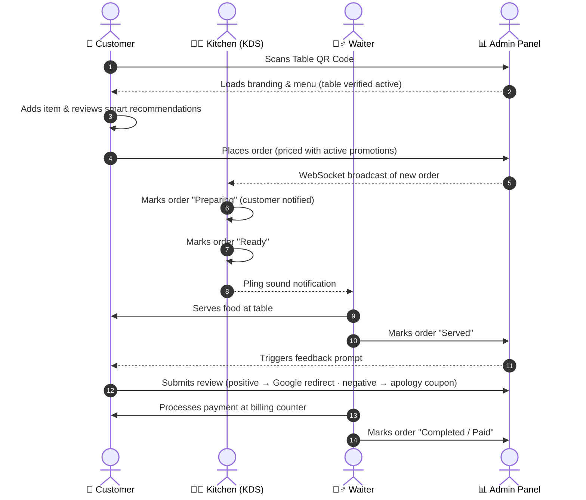

<div align="center">

<br/>

# 🍽️ &nbsp;Zappy

<a href="#"></a>

<br/><br/>

<a href="#"></a>
<a href="#"></a>
<a href="#"></a>
<a href="https://github.com/shadow-byte-warrior/Zappy/issues"></a>

<br/><br/>

### *A real-time, multi-tenant restaurant operating system — QR ordering, dynamic promotions, AI-driven food pairing, and live kitchen ops in one platform.*

<br/>

[](https://github.com/shadow-byte-warrior/Zappy/stargazers)
[](https://github.com/shadow-byte-warrior/Zappy/network/members)
[](https://github.com/shadow-byte-warrior/Zappy/pulls)
[](https://github.com/shadow-byte-warrior/Zappy/issues)
[](https://github.com/shadow-byte-warrior/Zappy/graphs/contributors)
[](./LICENSE)

</div>

<br/>

<div align="center">

### 🧭 Explore by module

| | | |
|:---:|:---:|:---:|
| 🛒 **[Customer Ordering](#-customer-ordering-flow)** | 🍳 **[Kitchen Display](#-kitchen-display-system-kds)** | 💳 **[Billing Counter](#-waitstaff--billing-counter)** |
| 📊 **[Admin Dashboard](#-restaurant-admin-dashboard)** | 👑 **[Super Admin](#-superadmin-command-center)** | 🧠 **[Food Graph AI](#-core-modules)** |
| 🔄 **[Realtime Sync](#️-system-architecture--workflow)** | 🧱 **[Project Structure](#-project-structure)** | ⚙️ **[Setup](#️-setup--installation)** |

</div>

<br/>

---

<br/>

## ✨ Overview

**Zappy** is an enterprise-grade, multi-tenant B2B SaaS platform that digitizes the entire restaurant dining experience — from the moment a guest scans a table QR code to the moment their bill is settled. It ships with real-time WebSocket order sync, a rules-based promotion/tax engine, an ingredient-aware food recommendation graph, and automated post-order reputation management.

Row-level security enforces strict tenant isolation — a restaurant admin can never read or write another tenant's data, even though every tenant shares the same application instance.

<br/>

## 🏗️ System Architecture & Workflow

Zappy synchronizes five operating flows in real time via WebSockets and PostgreSQL triggers:



<br/>

## 🧩 Core Modules

<details>
<summary><strong>📱 Customer Ordering Flow</strong></summary>
<br/>

1. **QR Scan & Verification** — customer scans the table QR, navigating to `/order?r=RESTAURANT_ID&table=TABLE_NUMBER`; the system verifies the table exists and is active.
2. **Menu Browsing** — menu loads with the tenant's custom branding, theme colors, and cover banner.
3. **Cart Pricing Engine** — dynamically resolves BOGO deals, item-specific discounts, and percentage offers, then enforces minimum-spend limits.
4. **Food Graph Upsells** — recommends pairings based on the ingredients/types already in the cart (e.g. a sweet beverage alongside a spicy main).
5. **Checkout** — order and order items are persisted to the database.

</details>

<details>
<summary><strong>👨‍🍳 Kitchen Display System (KDS)</strong></summary>
<br/>

1. **WebSocket Trigger** — the kitchen display receives new orders instantly.
2. **Status Transitions** — staff move orders `pending → preparing → ready`, with live prep timers.
3. **SLA Monitoring** — an order flashes red if it exceeds a 20-minute prep window.

</details>

<details>
<summary><strong>💁‍♂️ Waitstaff & Billing Counter</strong></summary>
<br/>

1. **Waiter Call** — customers summon staff directly from their phone.
2. **Serving** — waiter marks the order `served`.
3. **Billing** — computes subtotal, GST, and service charge, then outputs a print-ready invoice; the transaction is finalized as `completed / paid`.

</details>

<details>
<summary><strong>📊 Restaurant Admin Dashboard</strong></summary>
<br/>

- **Menu Manager** — categories, items, variant selections, prices, banners, and category thumbnails.
- **QR Generator** — table-specific, trackable QR codes, downloadable at 1200px print resolution.
- **Reputation Center** — happy customers are routed to Google Reviews; unhappy customers receive a server-generated recovery coupon.

</details>

<details>
<summary><strong>👑 Superadmin Command Center</strong></summary>
<br/>

- **Tenant Management** — subscription tiers (Free / Pro / Enterprise) and onboarding progress.
- **Global Ads** — campaigns that inject promotional banners into target menus.
- **Platform Analytics** — global revenue graphs and cross-tenant metrics.

</details>

<br/>

## 🧰 Tech Stack

<div align="center">


</div>

<br/>

## 📂 Project Structure

Zappy follows a **page-colocation architecture**: files are grouped by the page/feature that owns them first, type second. Only code genuinely shared by 2+ pages lives in `src/shared/`.

```
Zappy/
├── .env.example
├── Dockerfile                  # Multi-stage production build
├── nginx/
│   └── nginx.conf              # Reverse proxy with strict headers
├── src/
│   ├── app/                    # App shell — App.tsx, main.tsx, global CSS
│   ├── pages/
│   │   ├── landing/            # Marketing site
│   │   ├── customer-menu/      # QR ordering, cart, recommendations
│   │   ├── billing-counter/    # Atomic billing, receipt printing
│   │   ├── kitchen-dashboard/  # KDS, station filters, TV mode
│   │   ├── waiter-dashboard/   # Waiter management
│   │   ├── qr-center/          # QR generation & print center
│   │   ├── admin-dashboard/    # Tenant admin tools
│   │   ├── super-admin/        # Platform-level command center
│   │   ├── auth/                # Login, password reset, role guards
│   │   ├── feedback/, blog/, request-quote/, user-guide/
│   │   └── not-found/
│   └── shared/                 # Used by 2+ pages only
│       ├── components/ui/      # shadcn primitives
│       ├── hooks/               # useMenuItems, useRestaurant, useFeatureGate...
│       ├── services/            # openai/, promotions/, recommendations/, reviews/
│       └── integrations/
│           └── supabase/        # client.ts, types.ts, functions.ts
└── supabase/
    ├── config.toml              # Edge function config
    └── migrations/               # Production SQL migrations
```

<br/>

## 🖼️ Screenshots

<div align="center">

<!--
  Add real screenshots here once you have them — drop image files into
  a `docs/screenshots/` folder and swap the placeholders below, e.g.:
  
-->

| Customer Menu | Kitchen Display |
|:---:|:---:|
| *📸 add screenshot →* `docs/screenshots/customer-menu.png` | *📸 add screenshot →* `docs/screenshots/kds.png` |
| Admin Dashboard | Billing Counter |
| *📸 add screenshot →* `docs/screenshots/admin.png` | *📸 add screenshot →* `docs/screenshots/billing.png` |

</div>

<br/>

## ⚙️ Setup & Installation

**Prerequisites:** Node.js v18+ or v20+, npm

```bash
git clone https://github.com/shadow-byte-warrior/Zappy.git
cd Zappy
cp .env.example .env        # add Supabase keys, Unsplash secrets, VITE_APP_URL
npm install
```

**Run locally**
```bash
npm run dev
```

**Production build**
```bash
npm run build
```

<br/>

## 🔑 Demo Credentials

<details>
<summary><strong>Click to reveal seeded test accounts</strong></summary>
<br/>

> ⚠️ **Demo/seed data only.** Multi-tenant row-level security ensures restaurant admins can only read/write their own tenant's data. Rotate these before any public deployment.

| Email | Password | Role | Tenant / Scope |
|---|---|---|---|
| `zappyscan@gmail.com` | *Set in Dashboard* | `super_admin` | Global Platform Control |
| `spicegarden@zappy.ind.in` | `arun4709s` | `restaurant_admin` | Spice Garden (Indian Cuisine) |
| `urbanfork@zappy.ind.in` | `arun4709s` | `restaurant_admin` | Urban Fork (Continental/Fusion) |
| `admin123@gmail.com` | `admin123` | `restaurant_admin` | Zappy Demo Restaurant |

</details>

<br/>

## 🗺️ Roadmap

**Sprint 7 — Customer Review, Super Admin, Seed Data & E2E Audit**

`███████░░░░░░░░░░░░░ 3 / 13 complete`

- [x] Move customer rating out of automatic post-order served flow
- [x] Add standalone customer review entry point in customer profile
- [x] Fix feedback route table resolution for QR table numbers and table UUIDs
- [ ] Verify customer review insert against Supabase after migrations are applied
- [ ] Apply pending database migrations in Supabase SQL Editor
- [ ] Create/verify super admin dashboard access for `zappyscan@gmail.com`
- [ ] Create two restaurant admin accounts with password `arun4709s`
- [ ] Seed two restaurants with at least 20 food items each
- [ ] Create five active tables per restaurant
- [ ] Audit full customer scenario: QR open → table select → menu load → cart → order → KDS → billing → review
- [ ] Audit restaurant admin isolation for both seeded restaurant users
- [ ] Audit super admin tenant management, admin accounts, logs, and dashboard UI
- [ ] Run full test suite, build, and customer-flow smoke test

<br/>

## 🤝 Contributing

Issues and PRs are welcome. Please open an issue describing the change before submitting a large PR, and keep new pages colocated under `src/pages/<page-name>/` per the [structure rule](#-project-structure) above.

## 📄 License

Distributed under the license specified in [`LICENSE`](./LICENSE).

<br/>

---

<div align="center">

*Built to transform restaurants into data-driven operating engines.*

**[⬆ back to top](#-zappy)**

</div>
