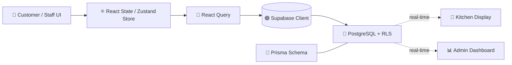

<div align="center">


# Zappy

### A real-time, multi-tenant restaurant operating system
**QR ordering • Dynamic promotions • AI-driven food pairing • Live kitchen ops — all in one platform.**

<br/>


<br/>


</div>


<br/>

## 📋 Table of Contents

- [✨ Overview](#-overview)
- [🚀 Key Features](#-key-features)
- [🧰 Tech Stack](#-tech-stack)
- [🏗️ Architecture](#️-architecture)
- [🧭 Module Map](#-module-map)
- [📁 Project Structure](#-project-structure)
- [⚙️ Getting Started](#️-getting-started)
- [🔄 Development Workflow](#-development-workflow)
- [🤝 Contributing](#-contributing)
- [📄 License](#-license)

<br/>

## ✨ Overview

**Zappy** is a multi-tenant restaurant operating system built for the full dine-in lifecycle — from a customer scanning a QR code at the table, to the order hitting the kitchen display in real time, to the bill printing at the counter, all the way up to platform-wide controls for super admins managing every tenant restaurant.

<br/>

## 🚀 Key Features

| | Feature | Description |
|---|---|---|
| 🛎️ | **QR Ordering** | Customers scan, browse, and order directly from their table — no app required |
| 🍳 | **Live Kitchen Display** | Real-time order pipeline synced via WebSockets, zero manual refresh |
| 💳 | **Integrated Billing** | POS-style billing counter with receipt printing (Bluetooth/USB) |
| 🧠 | **AI Food Pairing** | Smart pairing and upsell suggestions powered by a food relationship graph |
| 🏷️ | **Dynamic Promotions** | Configurable, real-time promotional rules per tenant |
| 🏢 | **True Multi-Tenancy** | Isolated branding, menus, and data per restaurant from one codebase |
| 🛠️ | **Super Admin Console** | Platform-wide visibility and control across every tenant |

<br/>

## 🧰 Tech Stack

<table>
<tr>
<td valign="top" width="50%">

**Frontend**


</td>
<td valign="top" width="50%">

**Backend & Database**


**Tooling**


</td>
</tr>
</table>

<br/>

## 🏗️ Architecture



1. **Client Interaction** — user interacts with a module (Customer Menu, POS, Admin Dashboard).
2. **State Management** — local state updates via React state or Zustand stores.
3. **API Requests** — React Query fetches/mutates data through the Supabase client or serverless endpoints.
4. **Database Operations** — Prisma defines the schema; Supabase handles PostgreSQL operations and Row Level Security (RLS).
5. **Real-time Updates** — Supabase real-time subscriptions push live updates (e.g., new orders appearing on the KDS).

<br/>

## 🧭 Module Map

| Module | Path | What it does |
|---|---|---|
| 🛎️ **Customer Menu** | `src/pages/customer-menu/` | Customer-facing digital menu & QR ordering flow |
| 🍳 **Kitchen Display** | `src/pages/kitchen-display/` | Real-time KDS for the order pipeline |
| 💳 **Billing Counter** | `src/pages/billing-counter/` | POS / billing counter interface |
| 📊 **Admin Dashboard** | `src/pages/admin-dashboard/` | Restaurant admin: sales, menus, users |
| 🛠️ **Super Admin** | `src/pages/super-admin/` | Platform-wide controls across tenants |
| 🌐 **Landing** | `src/pages/landing/` | Marketing landing pages |
| 🔐 **Auth** | `src/pages/auth/` | Login, reset password, auth flows |

<br/>

## 📁 Project Structure

<details>
<summary><b>Click to expand full file tree</b></summary>

```text
Zappy/
├── prisma/                 # Prisma ORM schema and configuration
│   └── schema.prisma       # Database schema definition
├── public/                 # Static assets (images, samples, icons)
├── scripts/                # Utility scripts for data manipulation/testing
├── src/                    # Main source code directory
│   ├── app/                # Application setup and entry points (App.tsx, main.tsx)
│   ├── assets/             # Local images and branding assets
│   ├── contexts/           # React context providers (TenantBrandingContext, etc.)
│   ├── generated/          # Generated Prisma client and models
│   ├── lib/                # Utility functions and printer logic (Bluetooth/USB)
│   ├── pages/              # Main route components and modules
│   │   ├── admin-dashboard/# Restaurant Admin interface (Sales, Menus, Users)
│   │   ├── auth/           # Authentication flows (Login, Reset Password)
│   │   ├── billing-counter/# POS/Billing Counter interface
│   │   ├── customer-menu/  # Customer facing digital menu & QR ordering
│   │   ├── kitchen-display/# Kitchen Display System (KDS)
│   │   ├── landing/        # Marketing landing pages
│   │   └── super-admin/    # Platform-wide super admin controls
│   ├── shared/             # Shared components and utilities
│   ├── stores/             # Zustand state management stores
│   ├── test/               # Test setup and utilities
│   └── utils/              # Helper functions
├── supabase/               # Supabase edge functions and migrations
├── docker-compose.yml      # Local services orchestration
├── package.json            # Project dependencies and scripts
├── tailwind.config.ts      # Tailwind configuration
├── vite.config.ts          # Vite configuration
└── README.md               # Architecture and workflow guide
```

</details>

<br/>

## ⚙️ Getting Started

### Prerequisites


### Installation

```bash
# 1. Clone the repository
git clone https://github.com/shadow-byte-warrior/Zappy.git
cd Zappy

# 2. Install dependencies
npm install

# 3. Configure environment variables
cp .env.example .env
```

```env
VITE_SUPABASE_URL=your_supabase_project_url
VITE_SUPABASE_ANON_KEY=your_supabase_anon_key
```

```bash
# 4. Start the development server
npm run dev
```

<br/>

## 🔄 Development Workflow

<details>
<summary><b>1. Database Schema & Prisma Sync</b></summary>
<br/>

- Define models and relationships in `prisma/schema.prisma`
- Generate the Prisma client: `npx prisma generate`
- Push schema changes to Supabase PostgreSQL via Prisma migrations or `db push`
- Configure Supabase RLS policies and auth settings (dashboard or migrations)

</details>

<details>
<summary><b>2. UI / Component Development</b></summary>
<br/>

- Build components inside the relevant `src/pages` module, or `src/shared` for global components
- Use Shadcn UI primitives for accessibility and consistent styling
- Apply Tailwind CSS for responsive, premium aesthetics (dark mode, glassmorphism, animation)

</details>

<details>
<summary><b>3. State & Data Integration</b></summary>
<br/>

- Use React Query for async data fetching and caching
- Use Zustand for complex state that needs to be globally accessible
- Write custom hooks (`useOrders`, `useInventory`, etc.) to abstract data logic from the UI

</details>

<details>
<summary><b>4. Testing & Polish</b></summary>
<br/>

- Write and run unit tests with Vitest: `npm run test`
- Test critical flows (Order Pipeline, QR Session lifecycle)
- Verify cross-device compatibility, especially mobile for the Customer Menu

</details>

<details>
<summary><b>5. Deployment</b></summary>
<br/>

- Verify the production build locally: `npm run build` (or `npm run build:dev`)
- Push to the repository
- Deploy the frontend to Vercel/Netlify (`vercel.json`)
- Confirm the production Supabase environment is synced and edge functions deployed

</details>

<br/>

## 🤝 Contributing

Contributions, issues, and feature requests are welcome!

1. Fork the project
2. Create your feature branch (`git checkout -b feature/amazing-feature`)
3. Commit your changes (`git commit -m 'Add some amazing feature'`)
4. Push to the branch (`git push origin feature/amazing-feature`)
5. Open a Pull Request

Please see the [Code of Conduct](CODE_OF_CONDUCT.md) and [Contributing Guide](CONTRIBUTING.md) before submitting.

<br/>

## 📄 License

This project is licensed under the terms specified in the [LICENSE](LICENSE) file.

<br/>

<div align="center">

**Built with ❤️ for restaurants everywhere**


</div>
